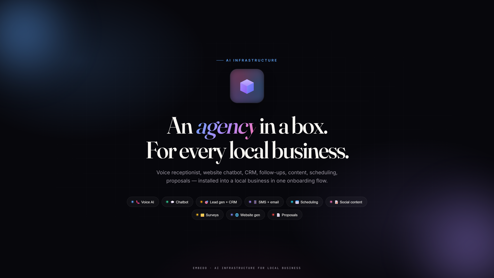

<div align="center">


# Embedo

### *AI infrastructure for local businesses.*

Install a complete AI automation layer into any local business in one onboarding flow — voice reception, chatbot, CRM, lead gen, content, scheduling, proposals. The agency-in-a-box.

<br/>


<br/>



</div>

---

## What is Embedo?

**Embedo** is AI infrastructure for local businesses. When a restaurant, gym, clinic, or service business is onboarded, Embedo automatically deploys a complete operating layer: a voice agent answers their phone, a chatbot handles their website, leads flow into a CRM, SMS and email follow-ups go out on schedule, social content is drafted, proposals are generated — all configured to their brand, their voice, their services.

The pitch to a business owner is simple: *"Stop stitching ten tools together. Onboard once, we install everything."*

---

## What gets deployed per business

### 📞 AI voice receptionist
ElevenLabs-powered agent answers calls in the business's voice, handles scheduling, captures leads, routes emergencies. Answers 24/7, never sleeps.

### 💬 Website chatbot
Claude-powered chat widget trained on the business's services, hours, pricing, and FAQs. Converts visitors into booked appointments without a human in the loop.

### 🎯 Lead generation + CRM
Every touchpoint — call, chat, form, review — funnels into one CRM. Automatic qualification, assignment, and follow-up sequences.

### 📱 Automated SMS + email
Triggered drip sequences (new lead, appointment reminder, post-service review request, win-back). Twilio + SendGrid.

### 📅 Appointment scheduling
Calendly integration. Chatbot and voice agent can book directly. Double-booking prevented.

### 📝 Social content + automation
Weekly content pipeline — drafts scheduled posts from the business's voice, tracks performance, suggests what to post next.

### 🗂️ Custom survey engine
Post-service surveys, NPS tracking, review funneling. Happy customers → Google reviews. Unhappy customers → internal alert.

### 🌐 Website generation
Auto-generated website from the business's onboarding data. Mobile-first, SEO-ready, live in minutes.

### 📄 Proposal generator
For service businesses (agencies, coaches, contractors) — custom proposals drafted from client briefs. Claude writes, you approve, client signs.

---

## Screenshots

<table>
  <tr>
    <td align="center">
      
      <sub><b>Onboarding</b> · install the full stack in one flow</sub>
    </td>
    <td align="center">
      
      <sub><b>Platform</b> · CRM, leads, agents, content</sub>
    </td>
  </tr>
  <tr>
    <td align="center">
      
      <sub><b>Voice agent</b> · ElevenLabs script + voice picker</sub>
    </td>
    <td align="center">
      
      <sub><b>Chatbot</b> · live preview with the business's data</sub>
    </td>
  </tr>
</table>

---

## Architecture

```
                         ┌───────────────────────────┐
                         │     Embedo Platform       │
                         │  (Next.js admin + creator)│
                         └──────────────┬────────────┘
                                        │
                ┌───────────────────────┼────────────────────────┐
                ▼                       ▼                        ▼
       ┌────────────────┐      ┌────────────────┐       ┌────────────────┐
       │  API Gateway   │      │   Services     │       │  Queue (BullMQ)│
       │   (Fastify)    │◄────►│  (domain-       │◄────►│   on Redis     │
       └────────┬───────┘      │   specific)    │       └────────────────┘
                │              └────────┬───────┘
                ▼                       ▼
       ┌────────────────────────────────────────┐
       │  Supabase Postgres (Prisma ORM)        │
       │  businesses, leads, conversations,      │
       │  content, appointments, proposals…      │
       └────────────────────────────────────────┘
                │
                ▼
       External: ElevenLabs · Claude · Twilio · SendGrid · Calendly
```

**Monorepo layout** — a single repo, multiple deployables:

- `apps/` — Next.js applications (api, client, creator, platform, web)
- `packages/` — shared libs (db schema, types, utils, queue helpers, config)
- `services/` — domain-specific backend services
- `infrastructure/` — Docker, Railway config, setup scripts

See [SYSTEM_MAP.md](./SYSTEM_MAP.md) for the full data flow and integration blueprint, and [CLAUDE.md](./CLAUDE.md) for development guidelines.

---

## Tech stack

| Layer | Technology |
|---|---|
| Monorepo | Turborepo + pnpm workspaces |
| Backend | Fastify + TypeScript |
| Frontend | Next.js 15 + Tailwind CSS v4 |
| Database | Supabase (Postgres) + Prisma |
| Queue | BullMQ + Redis (Upstash in prod) |
| Voice AI | ElevenLabs |
| Chat AI | Anthropic Claude (Sonnet 4) |
| SMS | Twilio |
| Email | SendGrid |
| Scheduling | Calendly |
| Deployment | Vercel (web) + Railway (services) |

---

## Getting started

### Prerequisites
- Node.js 20+
- pnpm 9+
- Docker + Docker Compose (for local Postgres + Redis)

### Setup

```bash
git clone https://github.com/jmarchese1/growth-os.git embedo
cd embedo
pnpm install

# Configure environment
cp .env.example .env.local
# Fill in .env.local with your own keys

# Start local infrastructure (Postgres + Redis)
docker compose -f infrastructure/docker/docker-compose.yml up -d

# Initialize database
pnpm db:generate
pnpm db:migrate
pnpm db:seed

# Start all services
pnpm dev
```

### Services (dev mode)

| Service | URL |
|---|---|
| API Gateway | http://localhost:3000 |
| Embedo landing | http://localhost:3010 |
| Admin Platform | http://localhost:3011 |
| Prisma Studio | http://localhost:5555 |

---

## Project structure

```
embedo/
├── apps/              # Deployable Next.js applications
│   ├── api/           # API gateway
│   ├── client/        # End-customer-facing widgets (chatbot, forms)
│   ├── creator/       # Content creator surface
│   ├── platform/      # Admin/operator dashboard
│   └── web/           # Marketing / landing
├── packages/          # Shared libraries (db, types, utils, queue, config)
├── services/          # Domain-specific backend services
├── infrastructure/    # Docker, Railway config, setup scripts
└── docs/              # Architecture docs + screenshots
```

---

## Deployment

- **Web apps:** Vercel (auto-deploy from `main`)
- **Backend services:** Railway (Dockerfile per service)
- **Database:** Supabase managed Postgres
- **Redis/queue:** Upstash
- **Voice:** ElevenLabs-hosted agents
- **SMS/Email:** Twilio + SendGrid

---

## License

Private — all rights reserved. Embedo © 2026.

## Author

Built by **Jason Marchese**.

Part of a series on building end-to-end products with **Claude Code** + the modern SaaS stack.
